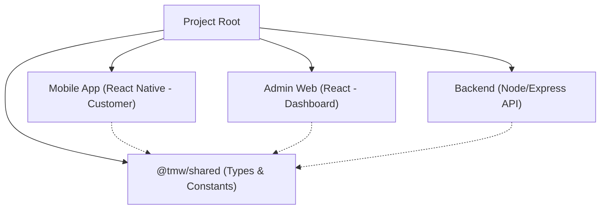

# Project Restructuring Walkthrough

The **தமிழ் Men's Wear** project has been successfully restructured into a modern hybrid architecture. This document outlines the new organization and key implementation details.

## 🏗️ Core Architecture

The project is now a monorepo utilizing **npm workspaces**, allowing for shared code and easier dependency management.

## 📱 Customer Mobile App (`/mobile-app`)
The customer application is now a pure **React Native (TypeScript)** project.
- **Strictly Customer-Facing**: All admin routes and screens have been removed.
- **Refined Navigation**: Uses a bottom tab navigator for core shopping features.
- **Enhanced Type Safety**: Fully converted to TypeScript with shared interfaces.
- **Clean Structure**: 
    - `src/services`: Centralized API logic.
    - `src/screens`: High-end Material Design 3 UI.
    - `src/store`: Redux Toolkit for state management.

## 💻 Admin Web Dashboard (`/admin-web`)
A brand new, high-performance **React.js (TypeScript)** web application.
- **Premium Design**: Sidebar-based layout with a dark, sophisticated "Gold & Slate" theme.
- **Vite Powered**: Ultra-fast development and build cycles.
- **Lucide Icons**: Modern, consistent iconography throughout.
- **Key Modules**:
    - **Dashboard**: Real-time business analytics and sales stats.
    - **Product Management**: Full CRUD operations with multi-image support.
    - **Orders & Inventory**: Streamlined tracking and low-stock alerts.

## ⚙️ Backend API (`/backend`)
A centralized, production-ready REST API.
- **Organized `src/`**: All logic has been moved from the root into a structured `src` folder.
- **Controller Pattern**: Unified business logic in controllers, separating concerns from routes.
- **Role-Based Security**: Enhanced middleware ensures customers only access mobile APIs and admins only access dashboard APIs.
- **Clean Routes**: Consolidated redundant route files and established a consistent `/api` prefix.

## 🤝 Shared Module (`/shared`)
A new cornerstone of the architecture that ensures consistency across all platforms.
- **Unified Types**: Interfaces for Products, Orders, and Users are defined once and used everywhere.
- **Shared Constants**: Branding and status codes are synchronized.
- **Utility Functions**: Common formatters and validators shared between Web and Mobile.

## 🚀 Getting Started

1. **Install Dependencies**: Run `npm install` in the root directory.
2. **Launch Backend**: `npm run start:backend`
3. **Launch Admin Web**: `npm run start:admin`
4. **Launch Mobile App**: `npm run start:mobile`

---
> [!NOTE]
> Use the `dev` script in the root (`npm run dev`) to start both the Backend and Admin Web concurrently for rapid development.
